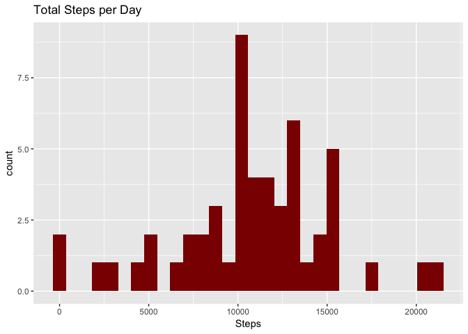
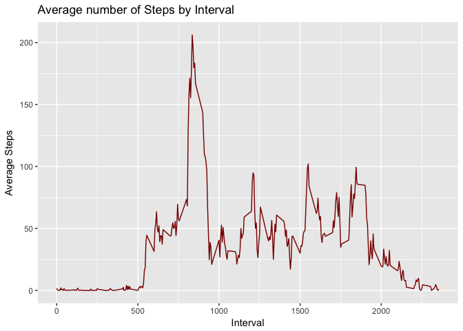
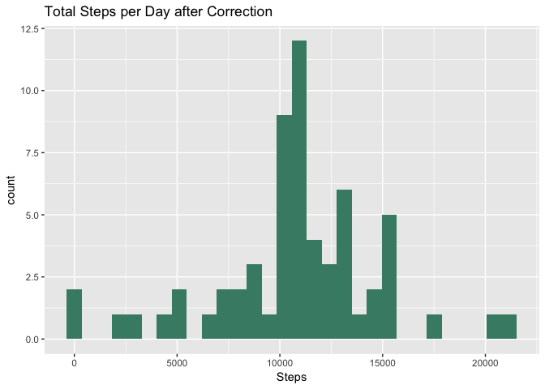
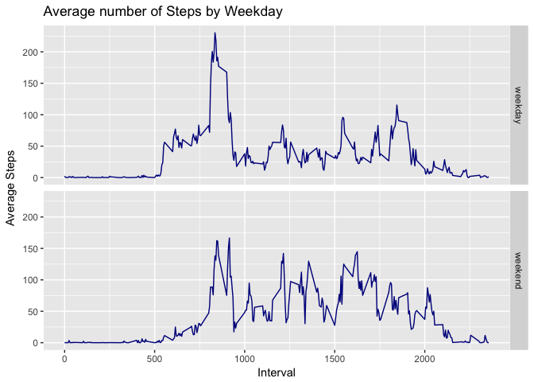

<br>

##### Prepared by *TG*, December 2017

<br>

### I. Introduction

<br>

This is the first report for assesment of *Reproducible Reserach* course in the *Coursera & Johns Hopkins Data Science Specialization* . The questions assigned will be answered in each of the numebered questions below. For this asignement:

* Data comes from a personal activity monitoring device that collects data at 5 minute intervals through out the day

* The data consists of two months of data from an anonymous individual collected during the months of October and November, 2012 and includes the number of steps taken in 5 minute intervals each day

* Data was taken from: https://d396qusza40orc.cloudfront.net/repdata%2Fdata%2Factivity.zip

* The variables included in this dataset are:

      + **steps**: Number of steps taken in a 5-minute interval (missing values are coded as `NA`)
      + **date**: The date on which the measurement was taken in YYYY-MM-DD
      + **interval**: Identifier for the 5-minute interval in which measurement was taken
  
<br>

* The dataset is stored in a comma-separated-value (CSV) file and has a total of 17,568 observations

* Asignement questions are answered following the order given in the instructions, with a brief decsrption of the steps undertaken and followed by the code used and its output

<br>

### II. Questions

<br>

#### Q1. Loading and preprocessing the data
<br>
1. The data was loaded ensuring character variables are read as characters and not factors so they can be esaily converted to Date format, and were assigned to the object *data*. Note the code assumes the unziped data file is in the current working directory.


```r
data <- read.csv("activity.csv", stringsAsFactors = FALSE)
```

<br>

2. A new factor variable *day* is created and *date* is transformed to date class to facilitate the analysis
<br>

```r
data$day <- as.factor(data$date)
data$date <- as.Date(data$date)
str(data)
```

```
## 'data.frame':	17568 obs. of  4 variables:
##  $ steps   : int  NA NA NA NA NA NA NA NA NA NA ...
##  $ date    : Date, format: "2012-10-01" "2012-10-01" ...
##  $ interval: int  0 5 10 15 20 25 30 35 40 45 ...
##  $ day     : Factor w/ 61 levels "2012-10-01","2012-10-02",..: 1 1 1 1 1 1 1 1 1 1 ...
```

<br>

#### Q2. What is the mean total number of steps taken per day?
<br>
1. To abtain the total numer of steps taken each day without missing values, data is filetered with the *dplyr* package to work only with the complete cases and then summarised by *day* with the following code:


```r
library("dplyr", lib.loc="/Library/Frameworks/R.framework/Versions/3.4/Resources/library")
data$complete <- complete.cases(data)
data1 <- filter(data, complete==TRUE)
by_day <- group_by(data1, day)
totday <- summarise(by_day, sum(steps))
totday
```

```
## # A tibble: 53 x 2
##           day `sum(steps)`
##        <fctr>        <int>
##  1 2012-10-02          126
##  2 2012-10-03        11352
##  3 2012-10-04        12116
##  4 2012-10-05        13294
##  5 2012-10-06        15420
##  6 2012-10-07        11015
##  7 2012-10-09        12811
##  8 2012-10-10         9900
##  9 2012-10-11        10304
## 10 2012-10-12        17382
## # ... with 43 more rows
```

<br>

The histogram for the total number of steps can then be created with the *ggplot2* package:


```r
library("ggplot2", lib.loc="/Library/Frameworks/R.framework/Versions/3.4/Resources/library")

ggplot( totday, aes(x=`sum(steps)`) ) + geom_histogram( fill = "red4" ) +
      ggtitle ( "Total Steps per Day" ) + labs( x= "Steps" )
```

<!-- -->

<br>  


2. The Mean and the median number of steps taken by day can be calculated from the dataset without mising values with


```r
mmday <- summarise(by_day, mean(steps), median(steps))
mmday
```

```
## # A tibble: 53 x 3
##           day `mean(steps)` `median(steps)`
##        <fctr>         <dbl>           <dbl>
##  1 2012-10-02       0.43750               0
##  2 2012-10-03      39.41667               0
##  3 2012-10-04      42.06944               0
##  4 2012-10-05      46.15972               0
##  5 2012-10-06      53.54167               0
##  6 2012-10-07      38.24653               0
##  7 2012-10-09      44.48264               0
##  8 2012-10-10      34.37500               0
##  9 2012-10-11      35.77778               0
## 10 2012-10-12      60.35417               0
## # ... with 43 more rows
```

<br>

#### Q3. What is the average daily activity pattern?
<br>
1. To obtain and plot the average number of steps for each 5-minute interval without the missing values, we use the filterd dataset to summarize the data by the `mean()` of *interval*, and then plot it in a histogram


```r
by_interval <- group_by(data1, interval)
intavg <- summarise(by_interval, mean(steps))
names(intavg) <- c("interval", "average_steps")

ggplot(intavg, aes(y = average_steps, x = interval) ) + geom_line(color = "red4") +
      labs(title = "Average number of Steps by Interval", y = "Average Steps", x = "Interval")
```

<!-- -->

<br>

2. The highest daily average number of steps is


```r
intavg$interval[ which.max(intavg$average_steps)]
```

```
## [1] 835
```

which has a value of 206.17 minutes.

<br>


#### Q4. Imputing missing values
<br>
1. The number of missing values in the dataset is 


```r
sum( is.na( data$steps ) )
```

```
## [1] 2304
```

which corresponds to roughly 13.11% of the total nuber of observations.

2. To deal with the bias in many calculations missing values may cause, an `NA` in a particular interval will be replaced by the average number of steps for the whole sample in that interval. 

<br>

3. The new database is stored in the object *data2* that replicates the original data but adds the correction. These two steps are achieved by the following code


```r
data2 <-data
data2$steps[is.na(data2$steps)] <- intavg$average_steps[ match(data2$interval[ is.na(data2$steps) ], intavg$interval)]
head(data2)
```

```
##       steps       date interval        day complete
## 1 1.7169811 2012-10-01        0 2012-10-01    FALSE
## 2 0.3396226 2012-10-01        5 2012-10-01    FALSE
## 3 0.1320755 2012-10-01       10 2012-10-01    FALSE
## 4 0.1509434 2012-10-01       15 2012-10-01    FALSE
## 5 0.0754717 2012-10-01       20 2012-10-01    FALSE
## 6 2.0943396 2012-10-01       25 2012-10-01    FALSE
```

<br>

4. The impact of the correction can be seen by calculating the **total number of steps** taken by day for *data2* and plotting a historgram. A summary for the total number of steps with and without the correction is also presented afterwards to facilitate comparisons:


```r
by_day <- group_by(data2, day)
totday1 <- summarise(by_day, sum(steps))

ggplot( totday1, aes(x=`sum(steps)`) ) + geom_histogram( fill = "aquamarine4" ) +ggtitle ( "Total Steps per Day after Correction" ) + labs( x= "Steps" )
```

```
## `stat_bin()` using `bins = 30`. Pick better value with `binwidth`.
```

<!-- -->

```r
summary(totday1$`sum(steps)`)
```

```
##    Min. 1st Qu.  Median    Mean 3rd Qu.    Max. 
##      41    9819   10766   10766   12811   21194
```

```r
summary(totday$`sum(steps)`)
```

```
##    Min. 1st Qu.  Median    Mean 3rd Qu.    Max. 
##      41    8841   10765   10766   13294   21194
```


The **mean** and **median** number of daily steps are calculetd first for the corrected dataset, and, to facilitate comparison, then for the original dataset


```r
by_day1 <- group_by(data2, day)
mmday1 <- summarise(by_day1, mean(steps), median(steps))
mmday1 
```

```
## # A tibble: 61 x 3
##           day `mean(steps)` `median(steps)`
##        <fctr>         <dbl>           <dbl>
##  1 2012-10-01      37.38260        34.11321
##  2 2012-10-02       0.43750         0.00000
##  3 2012-10-03      39.41667         0.00000
##  4 2012-10-04      42.06944         0.00000
##  5 2012-10-05      46.15972         0.00000
##  6 2012-10-06      53.54167         0.00000
##  7 2012-10-07      38.24653         0.00000
##  8 2012-10-08      37.38260        34.11321
##  9 2012-10-09      44.48264         0.00000
## 10 2012-10-10      34.37500         0.00000
## # ... with 51 more rows
```

```r
mmday
```

```
## # A tibble: 53 x 3
##           day `mean(steps)` `median(steps)`
##        <fctr>         <dbl>           <dbl>
##  1 2012-10-02       0.43750               0
##  2 2012-10-03      39.41667               0
##  3 2012-10-04      42.06944               0
##  4 2012-10-05      46.15972               0
##  5 2012-10-06      53.54167               0
##  6 2012-10-07      38.24653               0
##  7 2012-10-09      44.48264               0
##  8 2012-10-10      34.37500               0
##  9 2012-10-11      35.77778               0
## 10 2012-10-12      60.35417               0
## # ... with 43 more rows
```

The tables and histogram show

* The average and mean didn't change significantly because the missing values were concentrated in specific days and were replaced by values that 'replicate' the structure of the data.

* Correcting the missing values added 8 more days of data

* This changed the median of total steps by 1 and the interquantile range, but not the mean or the minimum and maximum values

* The original mean and median number of daily steps were not altered, but the new data has now 8 more observations

<br>

#### Q5. Are there differences in activity patterns between weekdays and weekends?
<br>
1. To answer this question we have to determine first the corresponding day of the week for each date, and then use it to create a factor variable *wkday* to separate between weekdays and weekends


```r
data2$weekday <- as.factor( weekdays(data2$date) )
weekend <- c ("Saturday", "Sunday")
data2$wkday <- as.factor( ifelse( data2$weekday %in% weekend, "weekend", "weekday") )

str(data2)
```

```
## 'data.frame':	17568 obs. of  7 variables:
##  $ steps   : num  1.717 0.3396 0.1321 0.1509 0.0755 ...
##  $ date    : Date, format: "2012-10-01" "2012-10-01" ...
##  $ interval: int  0 5 10 15 20 25 30 35 40 45 ...
##  $ day     : Factor w/ 61 levels "2012-10-01","2012-10-02",..: 1 1 1 1 1 1 1 1 1 1 ...
##  $ complete: logi  FALSE FALSE FALSE FALSE FALSE FALSE ...
##  $ weekday : Factor w/ 7 levels "Friday","Monday",..: 2 2 2 2 2 2 2 2 2 2 ...
##  $ wkday   : Factor w/ 2 levels "weekday","weekend": 1 1 1 1 1 1 1 1 1 1 ...
```

<br>

2. The differences in average steps can be seen with a time series plot for each type of weekday  


```r
by_interval2 <- data2 %>% group_by(interval, wkday)
intavg2 <- by_interval2 %>% summarise(mean(steps))

names(intavg2) <- c("interval", "wkday", "average_steps")

ggplot(intavg2, aes(y = average_steps, x = interval) ) + geom_line(color="blue4") + facet_grid(wkday~.) + 
      labs(title = "Average number of Steps by Weekday", y = "Average Steps", x = "Interval")
```

<!-- -->

